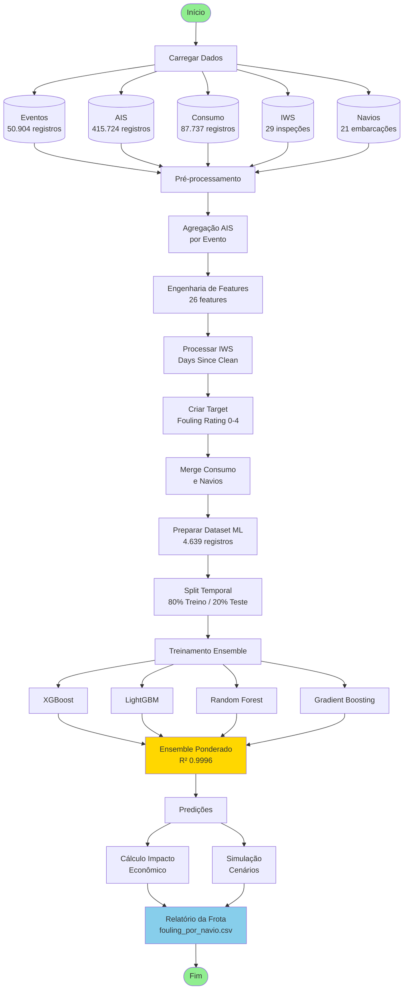
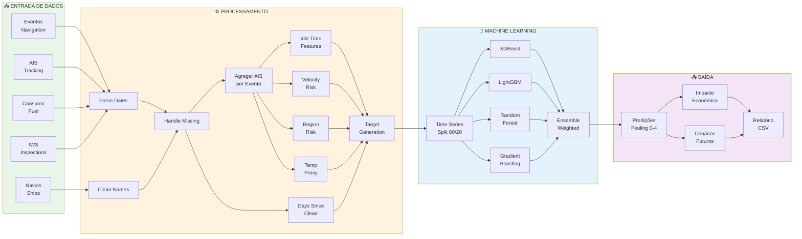
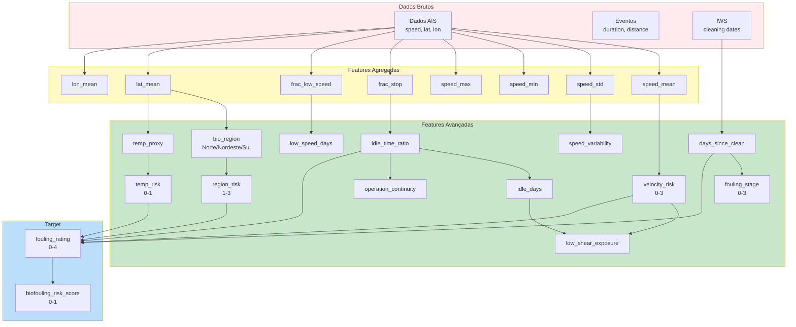
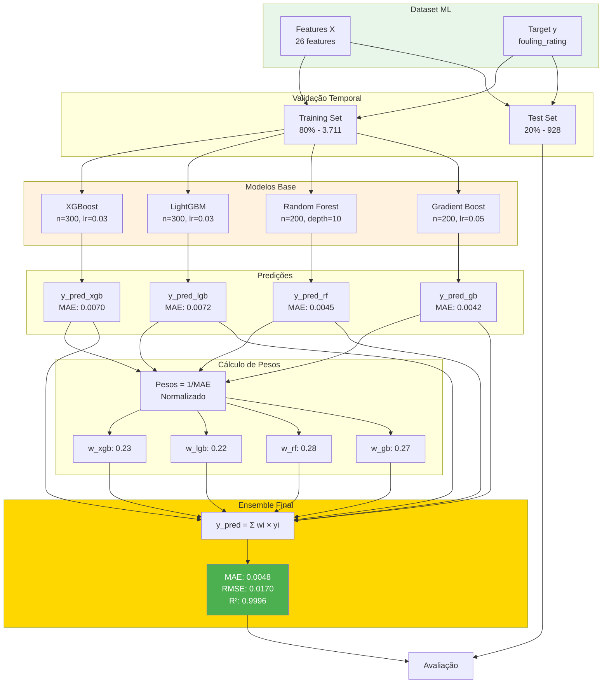
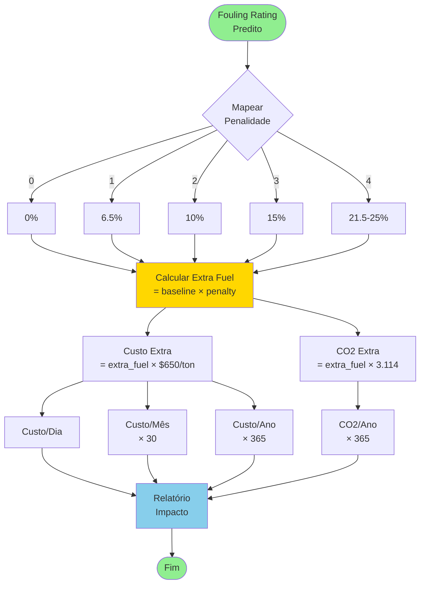
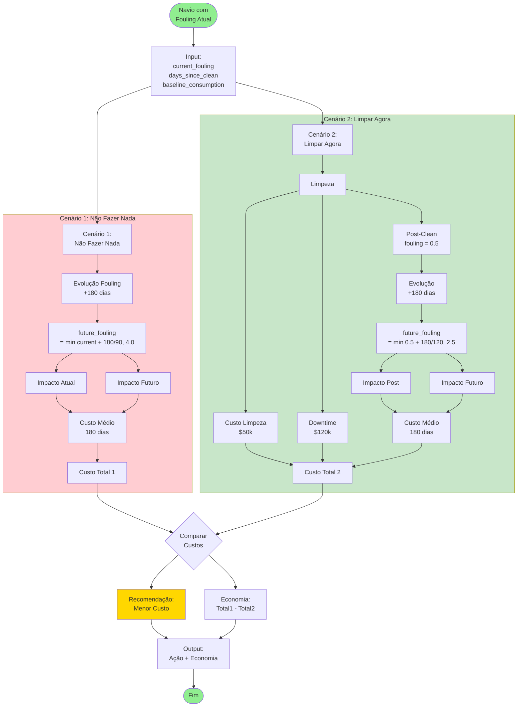
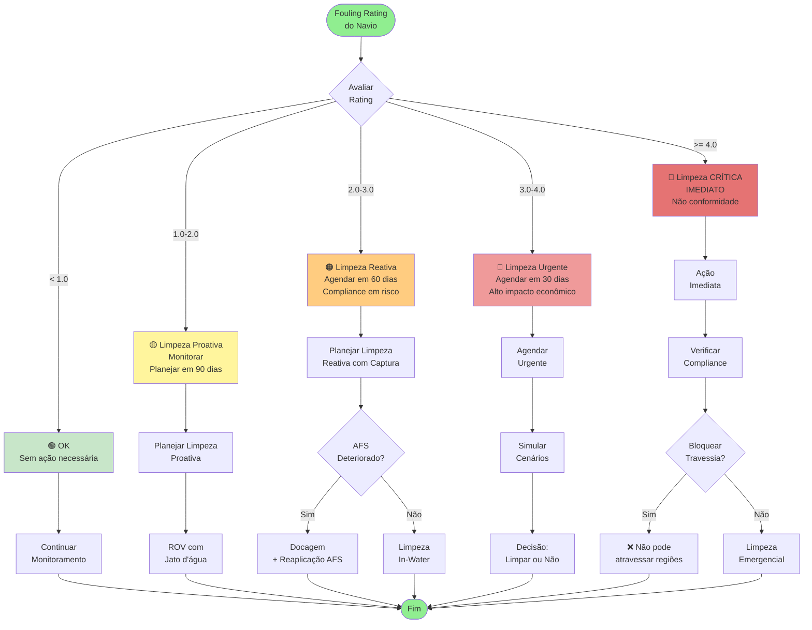
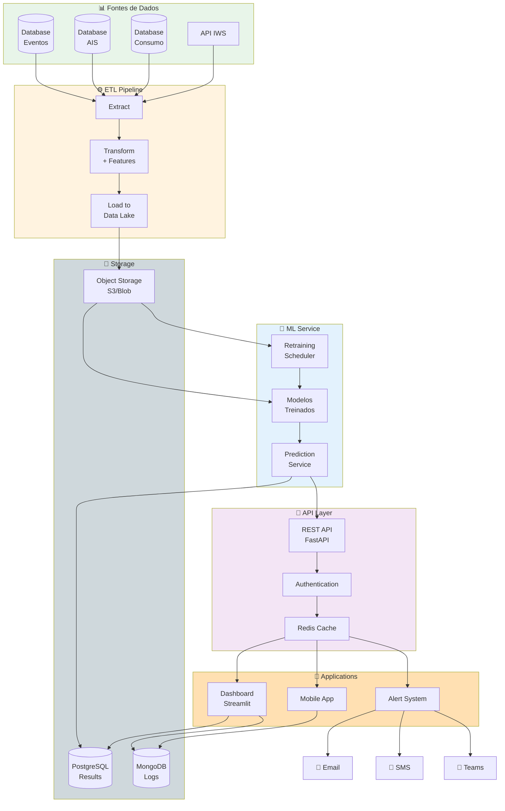
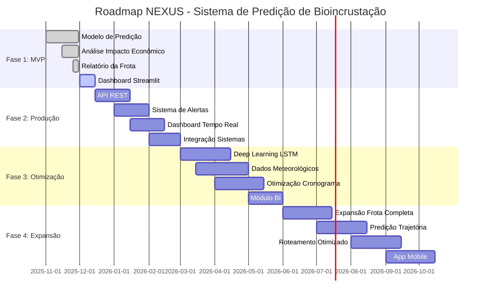
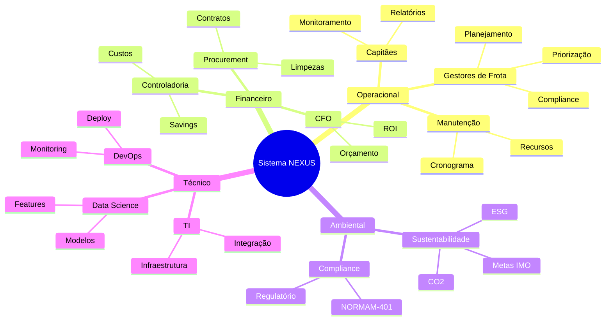

# 📊 Diagramas do Sistema NEXUS

## Visualizações em Mermaid

Este documento contém diagramas que explicam visualmente a arquitetura e fluxo do sistema.

---

## 1. Fluxo Geral do Sistema

---

## 2. Pipeline de Dados Detalhado

---

## 3. Engenharia de Features

---

## 4. Modelo Ensemble

---

## 5. Cálculo de Impacto Econômico

---

## 6. Simulação de Cenários

---

## 7. Fluxo de Decisão por Urgência

---

## 8. Arquitetura de Sistema (Deployment Futuro)

---

## 9. Timeline de Desenvolvimento

---

## 10. Mapa de Stakeholders

---

## Como Usar os Diagramas

### No GitHub/GitLab

Os diagramas Mermaid são renderizados automaticamente em arquivos Markdown.

### Em Apresentações

1. Use ferramentas como [Mermaid Live Editor](https://mermaid.live/)
2. Exporte como PNG/SVG
3. Insira nas apresentações

### Em Documentação

Cole o código Mermaid diretamente em:

- GitHub/GitLab README
- Confluence
- Notion
- Obsidian

---

**Equipe NEXUS** | Hackathon Transpetro 2025
